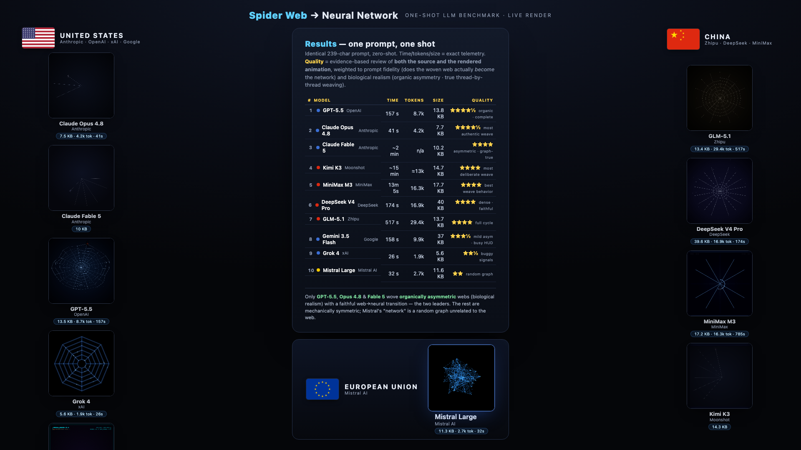

# 🕸️ SpiderWeb Bench

**A one-shot creative-coding benchmark for frontier LLMs.** Every model gets the same
single 239-character prompt and must return *one self-contained HTML file*:

> Create a single HTML file with an 800×800 `<canvas>` where a spider weaves a web,
> and once complete the web's threads turn into a glowing neural network with signals
> firing between nodes, then dissolves and the spider starts a new one. Loop.

No follow-ups, no fixes — **first generation only**. It's a compact stress test of
procedural geometry, time-based state machines, graph construction + simulation,
aesthetic judgment, and self-contained engineering (one file, no deps, 60 fps).



🌐 **Live demo → [skabber2000.github.io/spiderweb-bench/viewer/showcase.html](https://skabber2000.github.io/spiderweb-bench/viewer/showcase.html)**
(all 8 models rendering live, side by side) ·
🎞️ **[animation gallery (one by one)](https://skabber2000.github.io/spiderweb-bench/viewer/gifs.html)**

▶ **[Watch the side-by-side comparison video](media/spiderweb_bench_compare.mp4)** ·
🗂️ run each model live in [`viewer/gallery.html`](viewer/gallery.html)

---

## 🏆 Results (8 models, one prompt, one shot)

Scored by **evidence-based review of both the source and the rendered animation**,
weighted to **prompt fidelity** (does the woven web actually *become* the network) and
**biological realism** (organic asymmetry + true thread-by-thread weaving).

| # | Model | Provider | Quality | Time | Tokens | Size | Verdict |
|---|-------|----------|:-------:|-----:|-------:|-----:|---------|
| 1 | **GPT-5.5** | 🇺🇸 OpenAI | ★★★★½ | 157 s | 8.7k | 13.8 KB | Organic asymmetric web **and** polished **and** complete cycle in-window |
| 2 | **Claude Opus 4.8** | 🇺🇸 Anthropic | ★★★★½ | 41 s | 4.2k | 7.7 KB | Most authentic thread-by-thread weaving + asymmetry; understated/slow |
| 3 | MiniMax M3 | 🇨🇳 MiniMax | ★★★★ | 13m 5s | 16.3k | 17.7 KB | Best weave *behavior* (radials + return, then spiral); symmetric |
| 4 | DeepSeek V4 Pro | 🇨🇳 DeepSeek | ★★★★ | 174 s | 16.9k | 40 KB | Real adjacency-driven signal propagation; dense; symmetric |
| 5 | GLM-5.1 | 🇨🇳 Zhipu | ★★★★ | 517 s | 29.4k | 13.7 KB | Complete warm-amber cycle, particle dissolve; symmetric |
| 6 | Gemini 3.5 Flash¹ | 🇺🇸 Google | ★★★½ | 158 s | 9.9k | 37 KB | Mild asymmetry, busy HUD, slow payoff |
| 7 | Grok 4 | 🇺🇸 xAI | ★★½ | 26 s | 1.9k | 5.6 KB | Buggy signal renderer + teleporting spider |
| 8 | Mistral Large | 🇪🇺 Mistral AI | ★★ | 32 s | 2.7k | 11.6 KB | "Neural net" is a random graph, unrelated to the web |

<sub>¹ Pro tiers were quota-blocked on the test key; this is `gemini-3.5-flash`. MiniMax was
generated via web UI (API balance empty). All others via API.</sub>

### Takeaways
- **Capability is near-solved**: 6 of 8 implement all four phases with a faithful
  web→neural transition. The separation is craft, realism, and pacing.
- **Biological realism is the rare differentiator**: only **GPT-5.5** and **Opus 4.8**
  wove *organically asymmetric* webs. Everyone else is mechanically symmetric.
- **Two genuine defects**: Grok's signal renderer draws pulses between random node pairs
  (not along edges); Mistral discards the web and builds a random graph.
- **Effort ≠ quality**: ~30× latency spread (26 s → 13 min) and ~15× tokens for the same
  deliverable; neither the leanest (Grok) nor the heaviest (GLM/MiniMax) won.

Full per-model rationale + method: [`scores/evaluation.md`](scores/evaluation.md).

> **A note on scoring honesty.** An automated blind judge-panel
> ([`judge_panel.py`](judge_panel.py)) was run first and **rejected as unreliable** —
> lenient judges (Grok/DeepSeek scored almost everything 9–10) plus still-frame "polish"
> noise produced a nonsensical order. The ranking above is a careful human review of the
> code *and* the rendered filmstrips. Treat ★ as craft judgment, not gospel.

---

## Layout

```
SpiderWeb_Bench/
├── PROMPT.md                 # the exact, frozen prompt (single source of truth)
├── RUBRIC.md                 # weighted criteria
├── run_benchmark.py          # multi-provider one-shot runner (env-key driven)
├── judge_panel.py            # blind LLM judge panel (kept for transparency — see caveat)
├── record_showcase.py        # serve + Playwright-record the showcase → MP4 (ffmpeg)
├── record_gifs.py            # per-model 2-cycle GIFs, timing-aligned to a common length
├── capture_filmstrip.py      # 9-frame filmstrip per model (for quality review)
├── viewer/
│   ├── gallery.html          # side-by-side, run-live, manual scoring + leaderboard
│   ├── showcase.html         # flag-grouped comparison layout (used for the video)
│   └── gifs.html             # one-by-one animation gallery (2 cycles, time-aligned)
├── scores/                   # evaluation.md, notes.md, eval_results.json, logs
├── media/                    # comparison video, filmstrips, montages, stills
└── submissions/<model-id>/   # index.html (raw model output) + meta.json
```

## Reproduce

```bash
# 1. Generate (set whichever API keys you have; read from env only)
python run_benchmark.py --list
python run_benchmark.py --all          # or --models gpt-5.5 grok-4 ...

# 2. Compare interactively
python -m http.server 8099             # then open viewer/gallery.html

# 3. Record the comparison video
python record_showcase.py --seconds 55

# 4. Build the one-by-one animation gallery (per-model 2-cycle GIFs, time-aligned to 10s)
python record_gifs.py --target 10        # then open viewer/gifs.html
```

Keys (env): `OPENAI_API_KEY`, `XAI_API_KEY`, `GEMINI_API_KEY`, `ZHIPU_API_KEY`,
`MINIMAX_API_KEY`, `MISTRAL_API_KEY`, `DEEPSEEK_API_KEY`, `ANTHROPIC_API_KEY`.
Vendor model IDs drift — verify the `model` strings in `run_benchmark.py` before a run.

## Rules that keep it fair
- **Frozen prompt** — never reworded between models.
- **First generation only** — no "fix it" follow-ups; measures one-shot ability.
- **Raw artifact** — each `submissions/<id>/index.html` is exactly what the model emitted.

## License
MIT (harness/code) — see [`LICENSE`](LICENSE). Files under `submissions/` are third-party
model outputs included for comparison/research.
